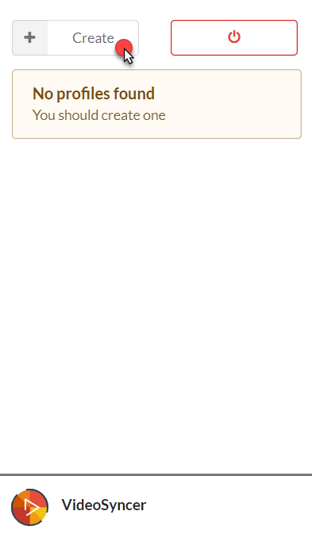
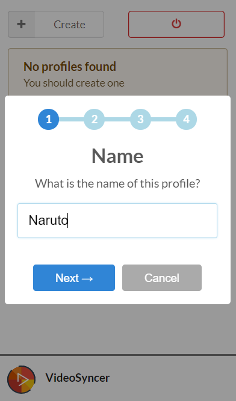
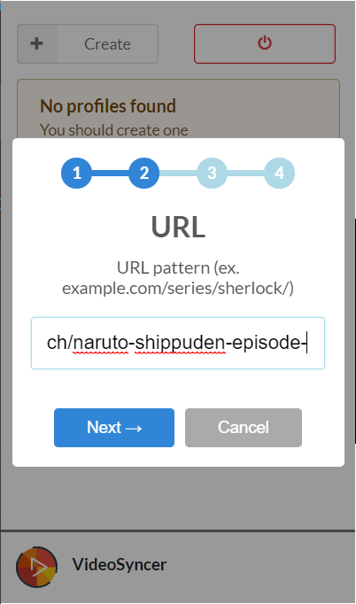
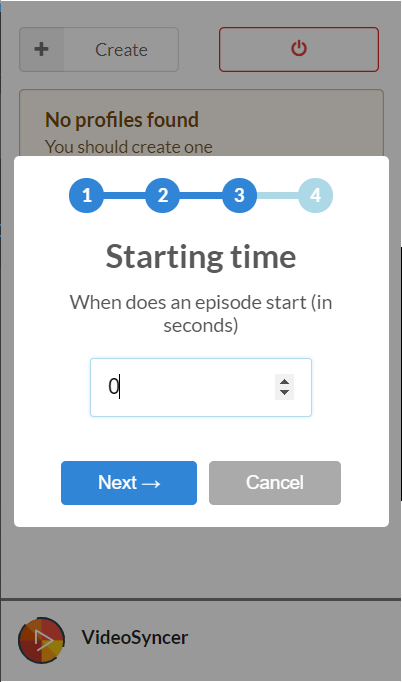
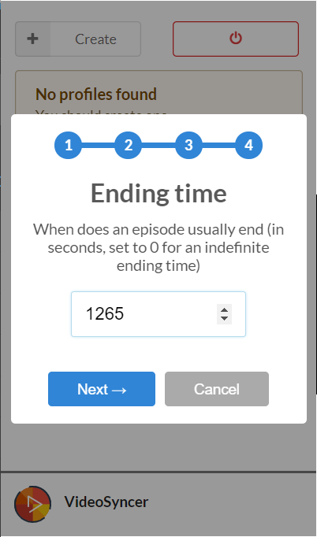
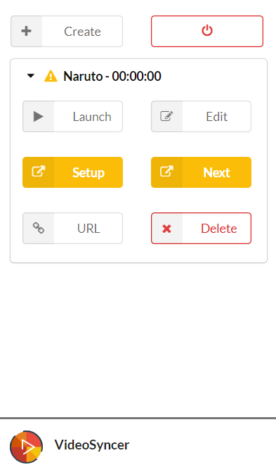
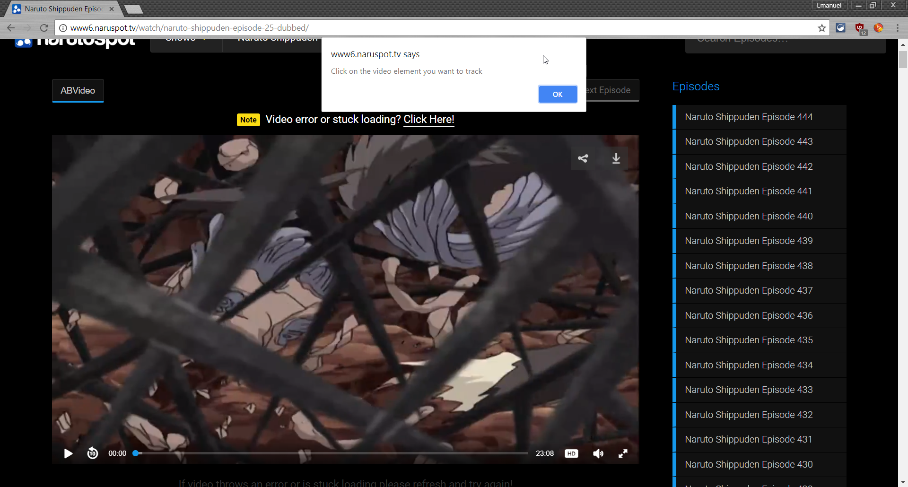
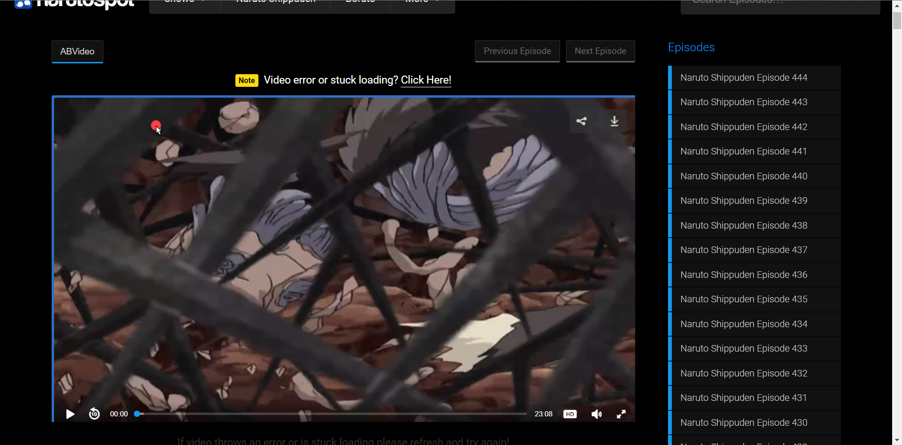
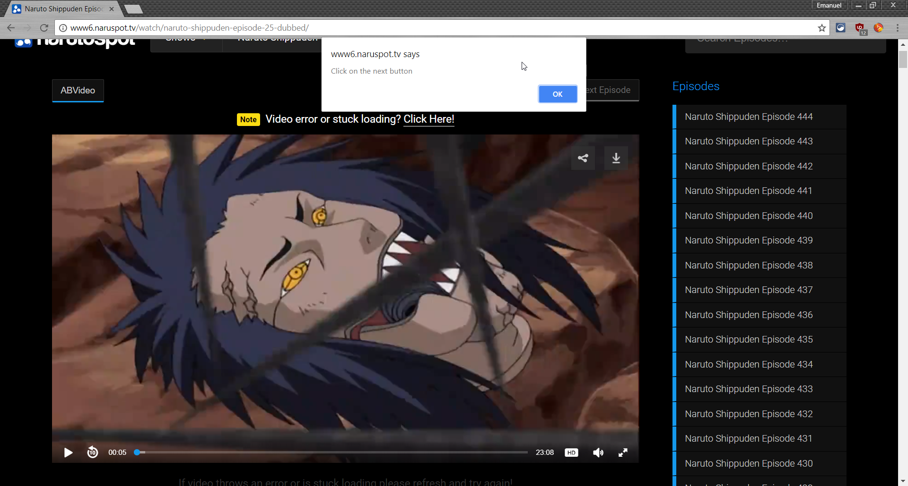

# VideoSyncer
{:.no_toc}

* Will be replaced with the ToC, excluding the "Contents" header
{:toc}

# Other References
1. [Developer Guide](developer.html)

# Getting started
## Create account / Login
First you will need to create an account or log in if you already have one.  
To create an account, just click on the 'Login with Google' button or enter an email.

## Create the first profile
VideoSyncer uses things called 'profiles' for tracking online video. Each profile represents a series of video.  
To create a new profile simply click on the 'Create' Button.

### Name
Give the profile a fitting name.

### URL Pattern
Define the url pattern for the profile.  
A url pattern is the part of the url which identifies the series while not changing in between episodes.
In our example we're currently at the 25th episode of Naruto, which has the url  
`http://www6.naruspot.tv/watch/naruto-shippuden-episode-25-dubbed/`  
Since we might sometimes use https instead of http and episode-25 is only for the 25th episode, we'll cut those parts out and get the url pattern:  
`www6.naruspot.tv/watch/naruto-shippuden-episode-` .

### Starting Time
The starting time is the time of each episode when the action starts.  
Useful for skipping intros with fixed length.  
Defaults to 0 seconds if left blank.

### Ending Time
The ending time is the time of each episode when the video is considered as ended and VideoSyncer autoplays to the next episode.  
Useful for skipping outros at fixed times.  
If left to 0 seconds will be considered as non-existent and VideoSyncer will only autoplay once the video ends.

## Setup profile
You will notice that there are some orange buttons inside the newly created profile, these are orange if the profile is missing some information.  
**You will need to refresh the page with the video in order for the next steps to properly work.**

### Setup VideoPlayer
The Setup button is used to define which video player is the one to track.  
This is critical if you're watching on a page with multiple media players (ads, other video).  
After clicking Setup you'll get a prompt from the page.

You can now click on the video player. An outline shows the element that will be selected when clicking.

The video player blinks briefly after clicking, indicating that it has been registered.

### Setup Autoplay
VideoSyncer will autoplay your video by pressing a next-button on the page.  
In order for this to work, you'll need to tell VideoSyncer where to click.  
This is done the same way as selecting a video player. You just press the Next button instead.

## Enjoy
With all these steps done, you're now ready to enjoy the series on all of your devices.