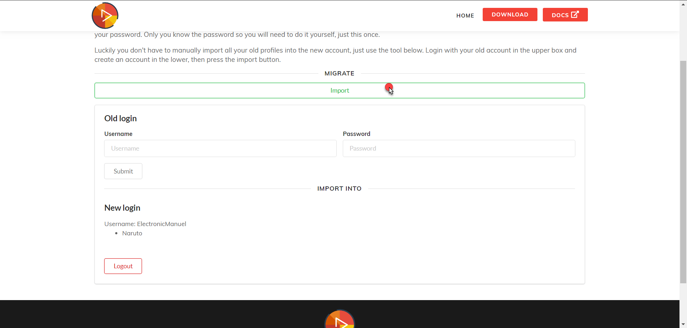

# Account Migration
{:.no_toc}

* Will be replaced with the ToC, excluding the "Contents" header
{:toc}

# Introduction
When we updated VideoSyncer from Version 4 to Version 5, we also migrated to a new database.  
Unfortunately, our old database had no way of exporting user passwords, since they were encrypted and we didn't have access to their encryption algorithm.

For this reason, your account has not been copied to the new database.

# Solution
We're providing a quick and easy way to import your old data into the new database.
Visit [our migration tool](https://vsync.ch/migrate), login with your old account and create a new one and simply click the import button.

